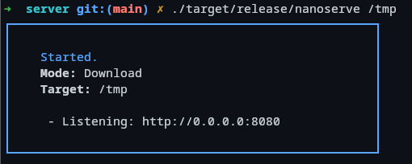

<!-- Improved compatibility of back to top link: See: https://github.com/othneildrew/Best-README-Template/pull/73 -->
<a id="readme-top"></a>

<!-- ABOUT THE PROJECT -->
## About The Project

I needed a simple too to transfer files between web-browsers. This is my naive approach at getting this in a single binary.

<p align="right">(<a href="#readme-top">back to top</a>)</p>

### Built With

- [Rust](https://www.rust-lang.org/)
- [Tide](https://github.com/http-rs/tide)
- [Bootstrap](https://getbootstrap.com/)

<p align="right">(<a href="#readme-top">back to top</a>)</p>

### Installation

1. Clone the repo
   ```sh
   git clone https://github.com/xcf-t/nanoserve.git
   ```
2. Build with cargo
   ```sh
   cargo build --release
   ```
3. Run executable
   ```sh
   ./target/release/miniserve
   ```

<p align="right">(<a href="#readme-top">back to top</a>)</p>


<!-- USAGE EXAMPLES -->
## Usage

```bash
Usage: nanoserve [OPTIONS] <PATH>

Arguments:
  <PATH>  The path to serve and store data

Options:
  -u, --upload                         Activate upload functionality
  -d, --download                       Activate download funcionality
  -p, --port <PORT>                    Port to listen on [default: 8080]
  -l, --listen                         Whether to listen on all interfaces. True by default
  -h, --help                           Print help
  -V, --version                        Print version
```

```bash
$ nanoserve [PATH] --download --upload --port 3000
```


<p align="right">(<a href="#readme-top">back to top</a>)</p>

<!-- LICENSE -->
## License

Distributed under the Apache 2.0 License. See `LICENSE.txt` for more information.

<p align="right">(<a href="#readme-top">back to top</a>)</p>

<!-- ACKNOWLEDGMENTS -->
## Acknowledgments

Styles and Icons by bootstrap, licensed under MIT.

* [Bootstrap 5](https://getbootstrap.com/)

<p align="right">(<a href="#readme-top">back to top</a>)</p>
